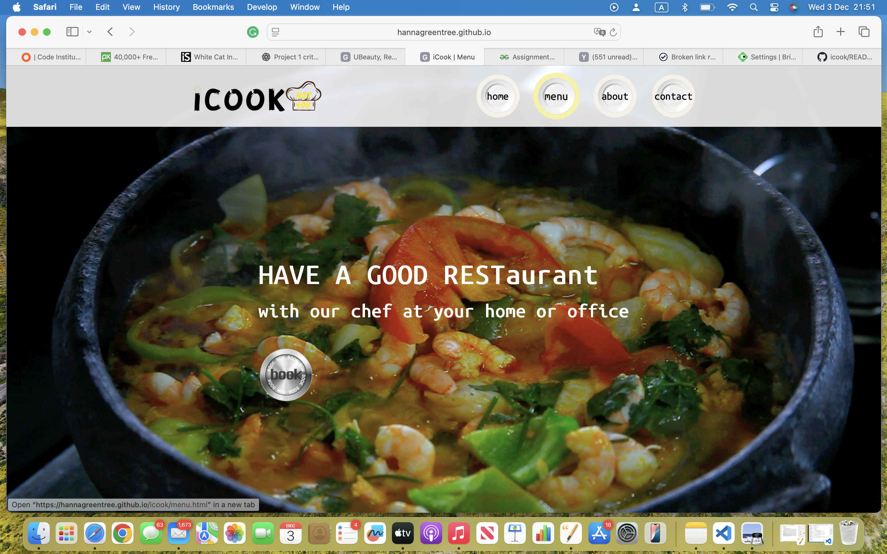
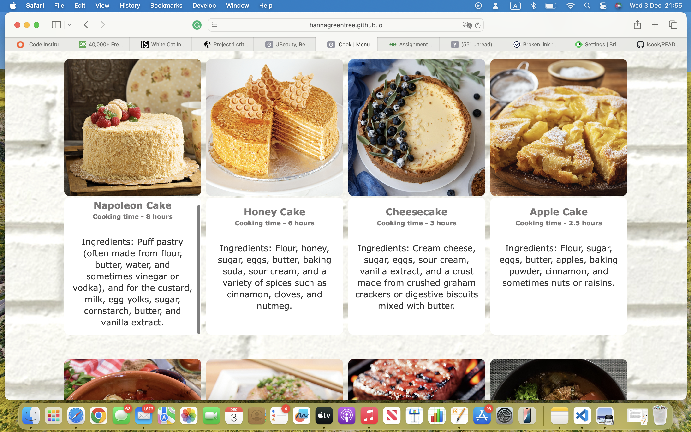
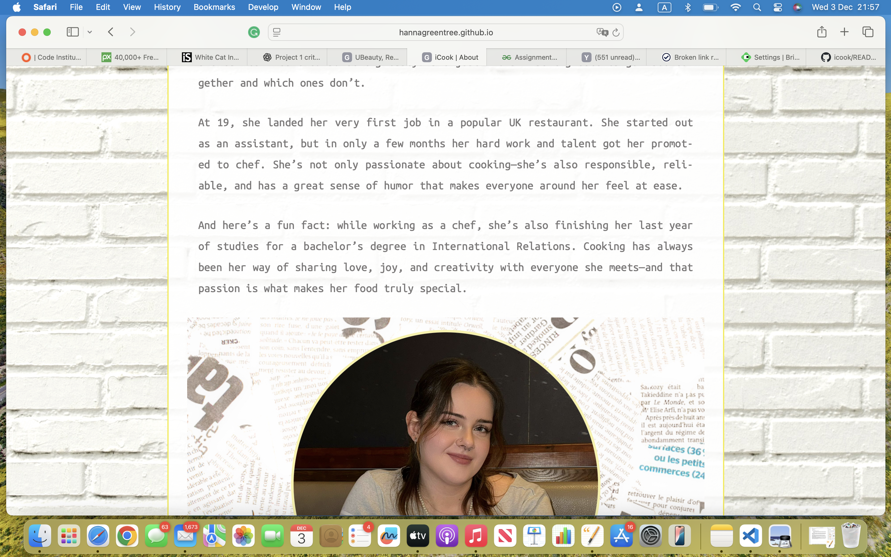
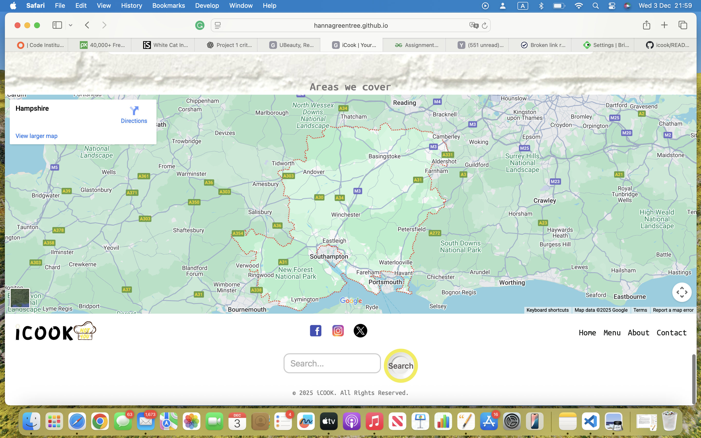
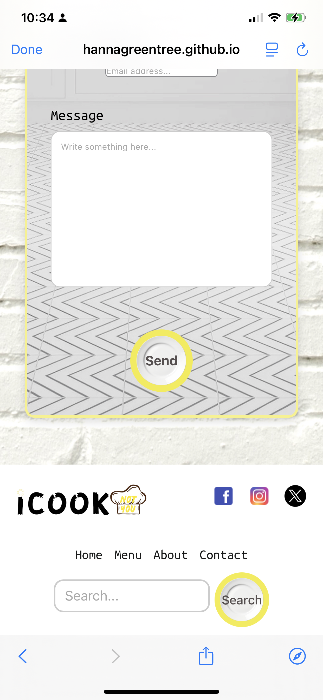
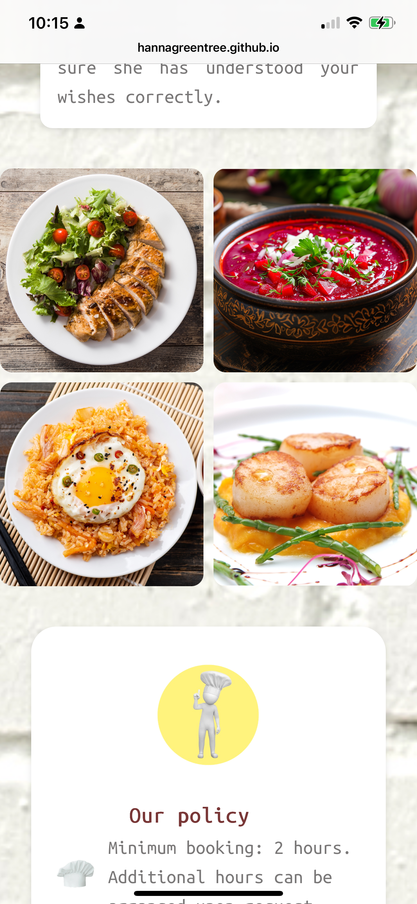

# iCook - Your Private Chef

## Purpose

The **iCook** website allows users to explore recipes, discover professional chefs, and book private cooking services. The goal is to provide a clean, user-friendly, responsive website accessible on all devices.

## Value to Users

* Browse delicious recipes instantly.
* Discover skilled chefs and their specialties.
* Access the site easily on mobile, tablet, or desktop.
* Enjoy a visually appealing layout and seamless navigation.

---

# 🚀 Deployment Procedure

1. Clone the repository:

   ```bash
   ```

git clone [https://github.com/HannaGreentree/iCOOK.uk.git](https://github.com/HannaGreentree/iCOOK.uk.git)

```
2. Open the project folder in VS Code.
3. Open **index.html** in the browser.
4. Live Deployment:
   - GitHub Pages: https://hannagreentree.github.io/icook/

---

# Wireframes
### Desktop Wireframes


### Mobile Wireframes


---

# 📸 Screenshots
### Desktop Screenshots

_User story: “As a user, I want to explore recipes easily.”_


_User story: “As a user, I want to view detailed recipe cards.”_


_User story: “As a user, I want to meet the chefs before booking.”_


_User story: “As a user, I want to check if the chef operates in my area.”_

### Mobile Screenshots

_User story: “As a user, I want links to chef social media profiles.”_


_User story: “As a user, I want to use the site on my phone.”_

---

# 🔗 3.3 Attribution / References
This project includes code, images, fonts, and ideas adapted from external sources. All external resources are acknowledged below.

## Code Inspiration & Tutorials
- **General HTML/CSS/JS help:** ChatGPT (OpenAI)
- **Responsive navigation & layout ideas:** https://www.w3schools.com
- **JavaScript animation logic:** https://codepen.io
- **Video positioning & behaviour:** https://developer.mozilla.org

## Media (Images & Videos)
- **Background videos:** https://pexels.com
- **Food images & recipe photos:** https://pexels.com , https://unsplash.com
- **Wireframes:** Designed personally by me.

## Fonts & Icons
- **Font Awesome icons:** https://fontawesome.com
- **Google Fonts:** https://fonts.google.com

## Tools Used
- Visual Studio Code (VS Code)
- Git & GitHub
- GitHub Pages (deployment)

---

# 🧩 Version Control (M iv)
### Overview
Version control was managed using **VS Code** and later GitHub. GitHub was introduced at the end of the project; therefore, the commit history does not reflect the actual development timeline. After learning its importance, commits were recreated to represent each development stage.

### Commit Timeline
| Step | Commit Message | Description |
|------|----------------|-------------|
| 1 | `Create basic HTML structure for homepage` | Added HTML base layout. |
| 2 | `Add CSS file and link to index.html` | Created and linked stylesheet. |
| 3 | `Add hero section with image and intro text` | Added welcome area with text. |
| 4 | `Style header, logo and navigation bar` | Applied typography, layout & colors. |
| 5 | `Add navigation menu with links to other pages` | Added functional nav bar. |
| 6 | `Add recipe section with grid layout` | Created recipe cards. |
| 7 | `Make the recipe grid responsive for mobile` | Added media queries. |
| 8 | `Add external links with target="_blank"` | Ensured safe external navigation. |
| 9 | `Fix layout spacing and validate CSS/HTML` | Passed W3C validator tests. |
| 10 | `Add footer with social media links` | Footer completed. |
| 11 | `Write and format README.md file` | Documented full project. |
| 12 | `Final testing and deployment to GitHub Pages` | Website published. |

---

# ✔️ 5.1 Manual Testing
Manual testing was completed on all devices and browsers.

### Functionality
- All navigation links work.
- Images load correctly.
- External links open safely in a new tab.

### Usability
- Text readable and well-spaced.
- Clear visual hierarchy.
- Intuitive navigation.

### Responsiveness
- Fully responsive on desktop, tablet, and mobile.
- Tested in Chrome, Firefox, Edge, Safari.

### Summary
- No broken links.
- All interactive elements behave correctly.
- All pages validated successfully.

---

# 🧪 5.4 Code Clean-Up
All unused CSS, JS, and HTML comments were removed before deployment.  
Only essential comments and attributions remain.

---

# 🔗 5.5 Internal Link Testing
### Internal Links Tested:
- **Home** → index.html
- **Menu** → #menu
- **About** → #about
- **Contact** → #contact
- **Logo** → Scrolls to top

### Results
- All internal links function correctly.
- Mobile & desktop navigation work smoothly.

---

# 📝 Project Rationale (M v)
The **iCook** website was built to support a local private chef business, helping clients find services, menus, and contact options quickly.

### Target Audience
- Families and individuals booking private meals.
- Event organisers.
- Pet owners looking for customised pet meals.

### Value
- Professional presentation.
- Simple and fast access to services.
- Fully responsive design.

---

# 🧩 M(vii) Development Note
The project was completed before using GitHub. Commits were recreated to document the process.
All features, testing, and design decisions are fully documented here.

---

# 📢 Honest Statement
This README covers all steps of planning, building, testing, and preparing the iCook website.  
All external sources are fully attributed, and the project meets required assessment criteria.

---

# Attribution Statement
All code is written by me unless stated otherwise.  
Where external ideas/snippets were used, they are clearly attributed in comments above the code sections.

```


---
