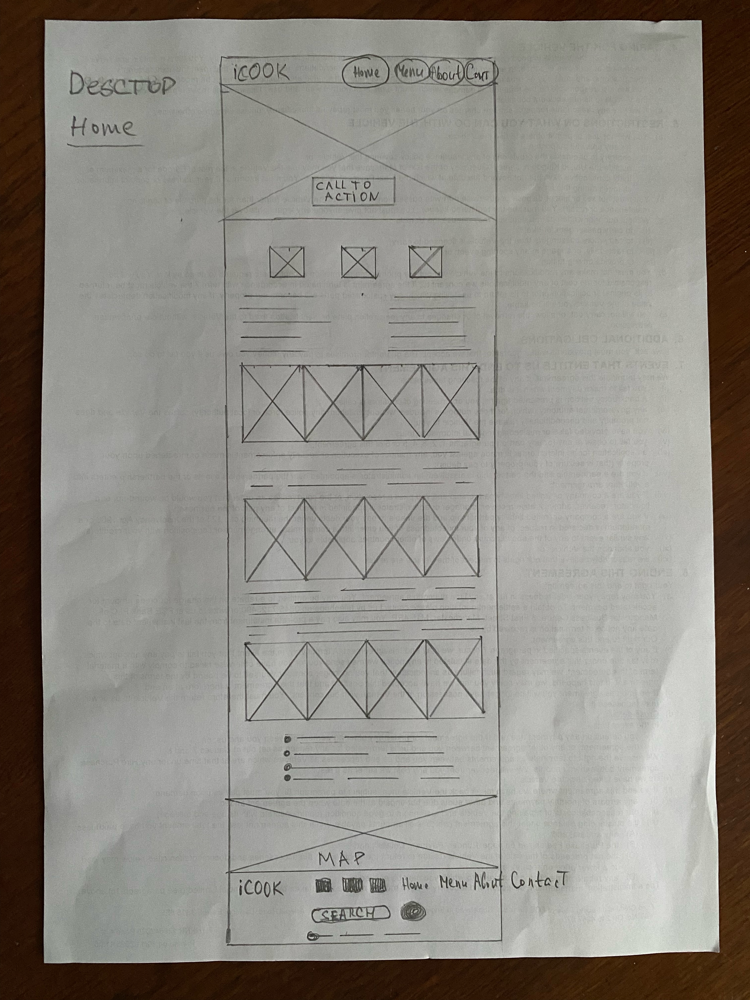
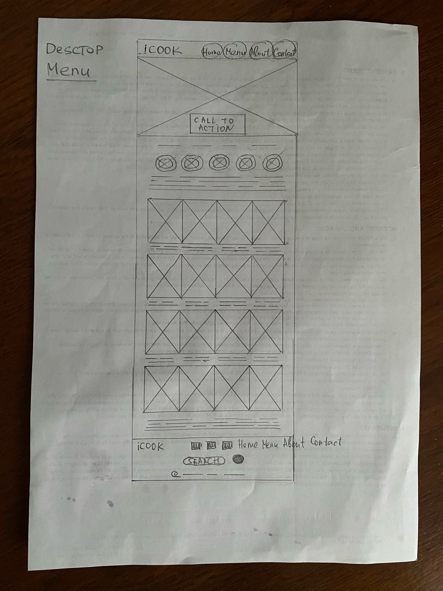
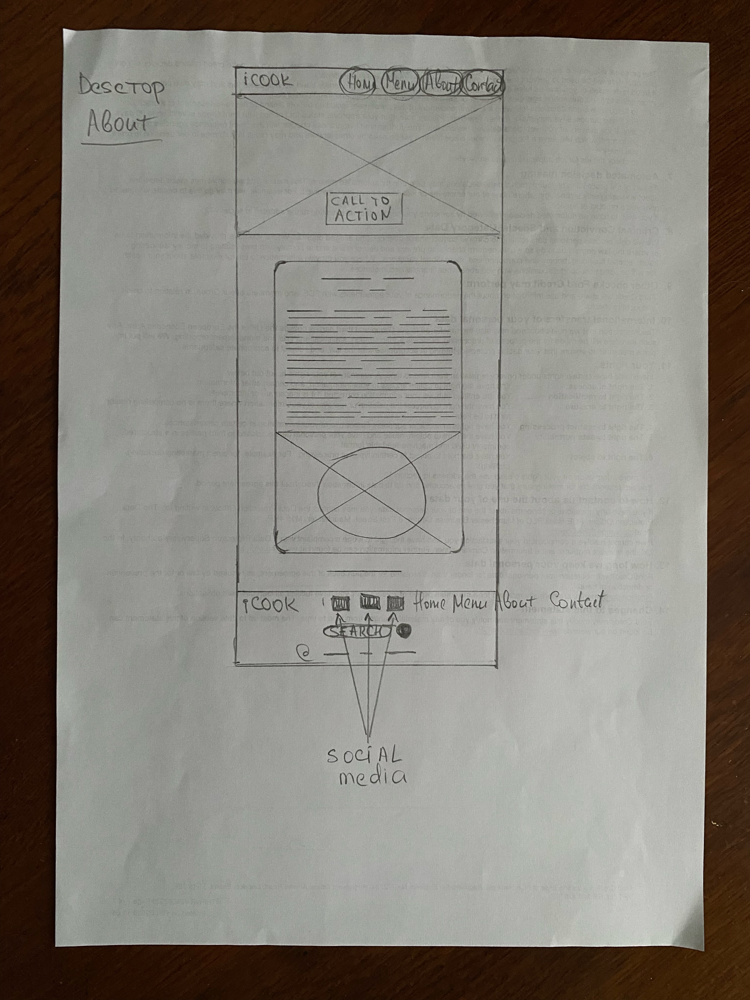
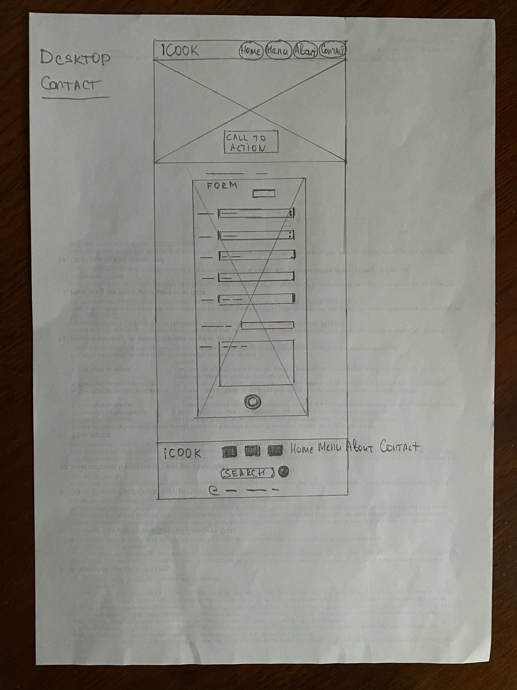
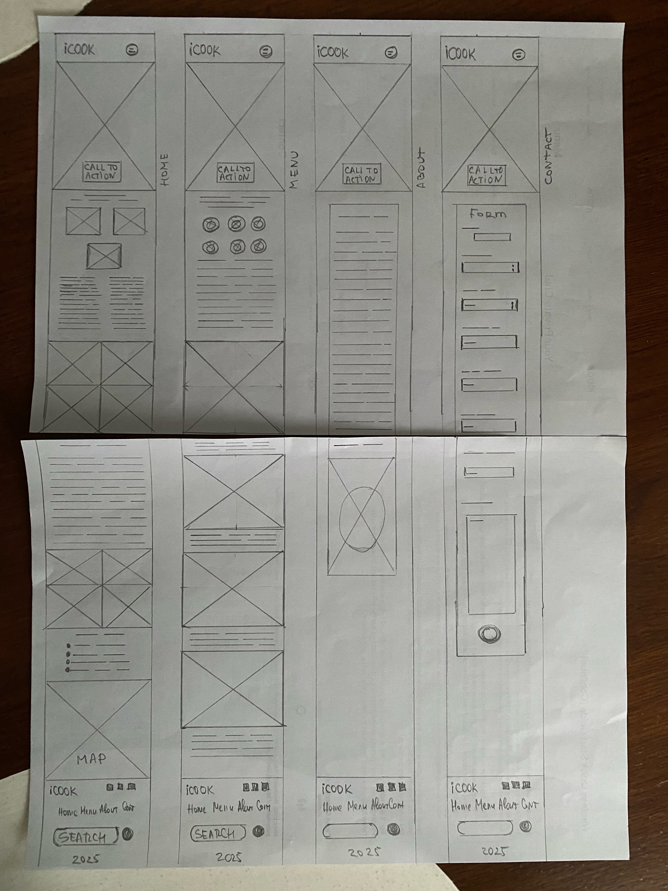

# iCook — Private Chef Website

**iCook** is a responsive static front end website for booking a private chef. It includes 4 pages such as home, menu, about, contact that comes with detailed explanation of the service offered, menu ideas, chef's story and contact/booking form.

Link to live demo: https://hannagreentree.github.io/icook/

---

## Technologies

- HTML5
- CSS3
- **JavaScript (Vanilla JS)** – Used in small snippets for smooth animations and subtle UI interactions

---

## Project Pages & Structure

- **Home (`index.html`)** Contains main screen video, call to action book button, services description and explanation, policy and the map with areas where chef operates, engaging layout
- **Menu (`menu.html`)** Contains unique main screen video, menu ideas from chef that including images, recipies and timing examples, interactive grid layout
- **About (`about.html`)** Contains unique main screen video, chef story, che's image, email contact
- **Contact (`contact.html`)** Contains a working contact form and call-to-action (“Book Now”) linking directly to the form section

---

## Features

- **Fully responsive layout** for desktop and mobile
- **Modern typography and color palette** for elegant presentation
- **Animated image collages and hover transitions**
- **Circular and grid-based content sections** using CSS Flexbox and Grid
- **Intuitive navigation menu** (navbar and footer) linking all pages
- **Custom contact form** for user engagement
- **Clean and organized CSS** following alphabetical property order for readability
- **Social media links** for more information for user

---

## Running Locally

To view or edit the project locally:

1. **Clone the repository**
   ```bash
   git clone https://github.com/<hannagreentree>/iCook.git
   cd iCook
   ```

## Credits

- Images licinse: (https://pixabay.com/photos/), (https://stock.adobe.com/)
- Fonts: [Short Stack](https://fonts.google.com/specimen/Short+Stack), [Ubuntu Mono](https://fonts.google.com/specimen/Ubuntu+Mono)

---

## Running locally

1. Clone the repository:
   ```bash
   git clone https://github.com/<your-username>/iCook.git
   cd iCook
   ```

# Wireframe

Here are the wireframes I designed for my website:

### 🖥️ Desktop Wireframes





### 📱 Mobile Wireframes



---
